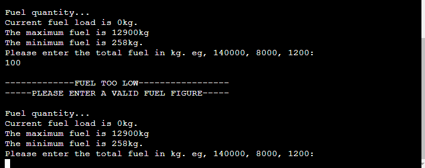
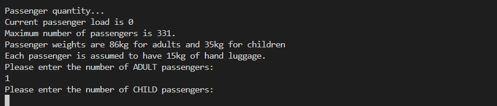
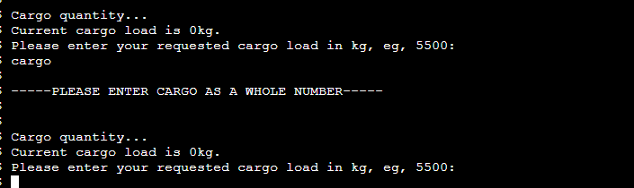
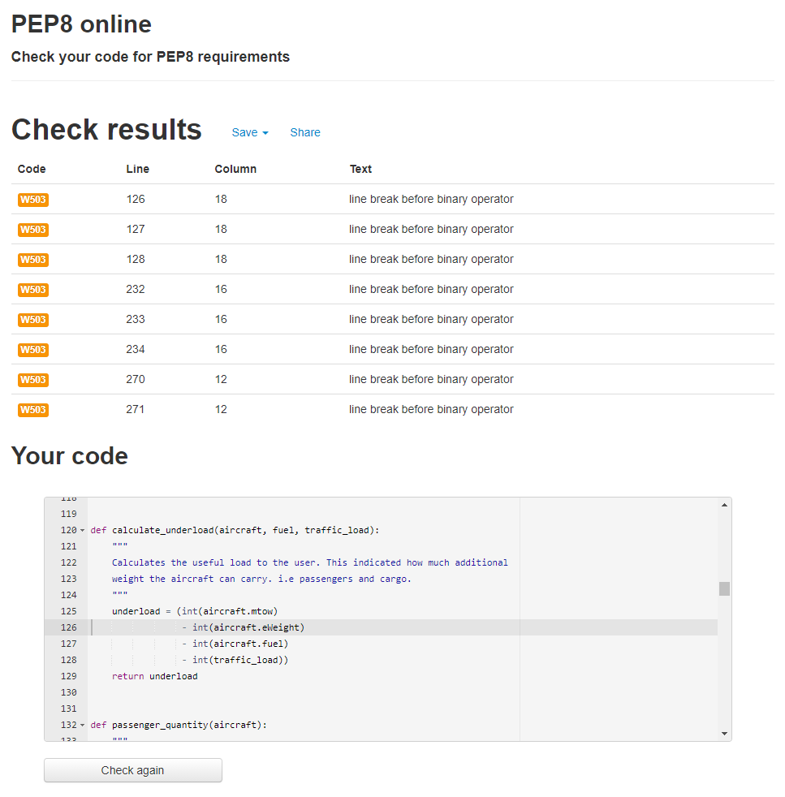
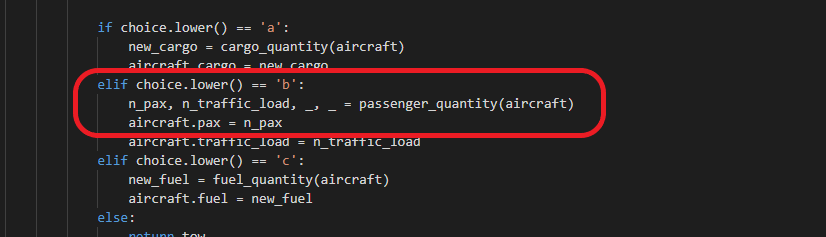

# Loadsheet Planner

The Loadsheet planner application is designed for use by an airline dispatcher to quickly calculate the acceptable loads whilst preparing an aircraft for dispatch.  
It is designed to take a number of inputs from the user to narrow down the acceptable fuel, passenger and cargo loads available to them. For the purpose of this application the fuel, passenger and cargo loads would have already been passed to the user from the Airline and Flight Crew.

To try your hand planning a loadsheet please click [**here**](https://loadsheet-planner.herokuapp.com/).

[**View your loadsheet here**](https://docs.google.com/spreadsheets/d/11693cya7PaL2sy6IjM4S__RAFoXotdeA6I_FLQwKygI/edit#gid=0
)

# Contents

* [**User Experience UX**](<#user-experience-ux>)
    *  [User Stories](<#user-stories>)
    * [Owner Stories](<#owner-stories>)
    * [Definitions](<#definitions>)
    * [Instructions](<#instructions>)
* [**Data Model**](<#data-model>)
    * [Code flow charts](<#code-flow-charts>)
    * [Class model](<#class-model>)
* [**Features**](<#features>)
    * [Existing Features](<#existing-features>)
    * [Future Features](<#future-features>)
* [**Technologies Used**](<#technologies-used>)
* [**Testing**](<#testing>)
    * [Bugs](<#bugs>)
    * [Testing User Stories](<#testing-user-stories>)
    * [Additional Testing](<#additional-testing>)
* [**Deployment**](<#deployment>)
* [**Credits**](<#credits>)
* [**Caveats**](<#caveats>)
*  [**Acknowledgements**](<#acknowledgements>)

# User Experience UX

## User Stories

* As a user I want to input data to creata a loadsheet.
* As a user I want to select which aircraft I am loading.
* As a user I want to input the fuel load.
* As a user I want to input the requested Passenger numbers.
* As a user I want to input the amount of cargo.
* As a user I want to know that my inputs are correct.

## Owner Stories

* As an owner I want to ensure the data entered is correct and valid.
* As an owner I want to ensure the loadsheet is useable by those detached from the input process.

[Back to top](<#contents>)
## Definitions
* Aircraft - 
    * Boeing 747-400 
    * Embraer 190 
    * Jetstream 41 

* Terminology - 
    * [**Loadsheet**](https://www.linkedin.com/pulse/aircraft-loadsheet-peter-irungu/) - Provides the crew with the various weights that are crucial for the flight. Compiled with information from the airline (passenger and cargo figures) and the crew themselves (fuel, aircraft specific weights).
    * [**Aircraft Dispatcher**](https://www.myworldofwork.co.uk/my-career-options/job-profiles/flight-dispatcher) - Provides the Pilots with the weight and balance information relevant to the flight. Also acts as the liaison between the Pilots and the loading staff.
    * **Flight crew** - In this case Pilots, could include loadmaster and navigatior if carried.
    * **Basic Weight** (eWeight in this app) - The weight of the aircraft without passengers, baggage or usable fuel.
    * **Traffic load** - For this app it is the mass of the passengers and bags. Often      cargo mass is also included in this definition.
    * **Cargo** - For this app it is the mass of cargo (could be baggage, animals, cars, ppe etc) that is in the aircraft hold (under the passengers).
    * **Zero Fuel weight (ZFW)** - The weight of the loaded aircraft without the fuel.
    * **Take off weight (TOW)** - The weight of the aircraft at take off. It is comprised off the Basic weight, traffic load and fuel. 
    * **Maximum take off weight (MTOW)** - The maximum weight the pilot is permitted to attempt to take off. Can be reduced for performance requirements (not functional in this app version).
    * **Underload** - The difference between the MTOW and the TOW.

[Back to top](<#contents>)
## Instructions

1. Select a, b or c to choose the aircraft you are going to load.
2. Input the fuel figure (in kg) that has been passed to you by the Flight crew.
3. Input the passenger numbers (adult/children) that has been passed to you by the Airline.
4. Input the cargo quantity (in kg) that has been requested by the Airline.
5. The Loadsheet Planner will check that the weights are all within the prescribed limits.
    If not it will give the user an option to alter some of the load.
6. The loadsheet prints automatically on completion of the above steps. Currently it prints to the app interface and to a google spreadsheet accessible by the button at the bottom of the interface.
7. The user is then given an option to load another flight or exit.

[Back to top](<#contents>)
# Data Model

## Code flow charts

[Back to top](<#contents>)
## Class model
The application is based on python classes. The return value from the select_aircraft function
creates an instance of the aircraft chosen. The respective loading figures are then populated into that instance to 'create' the loaded aircraft.

[Back to top](<#contents>)
# Features

## Existing Features 
* **Welcome page** 

Screenshots

    The page the Loadsheet Planner displays initially. 
    

* **Fuel input** 

Screenshots

    Initial fuel input page.  
    

    Too much fuel - Fuel input is above the maximum allowed.  
    

    Not enough fuel - Fuel input is below the minimum required.  
    

    Incorrect input character - Input is not a number.  
    

* **Passenger input** 

Screenshots

    Initial passenger input  
    

    Too many passengers  
    

    Incorrect input character  
    

* **Cargo input** 

Screenshots

    Initial cargo input  
    

    Incorrect input character  
    

* **High Take-off weight** 

Screenshots

    This feature prevents the aircraft from being loaded above the maximum take-off weight. If overweight, it gives the user the choice to remove passengers, fuel or cargo. 
    

* **Print Loadsheet** 

Screenshots

    Prints the compiled loadsheet to the application interface and gives the user the option to load another flight or exit.  
    

[Back to top](<#contents>)
## Future Features
* The loadsheet displaying on the browser screen. Within the confines of the CI template this feature isn't easily possible. For this release the loadsheet is stored as a pdf in the workspace after it is printed to the screen. Currently not accessible by the user. eg; [Loadsheet](loadsheet.pdf).

[Back to top](<#contents>)
# Technologies Used
* [Python](https://docs.python.org/3/contents.html) - primary language of the application.
* [GitHub](https://github.com/) - to host the repositories.
* [Gitpod](https://www.gitpod.io/) - as the IDE for the application.
* [Lucid Charts](https://www.lucidchart.com/) - to create the flow diagram.
* [OBS Studio](https://obsproject.com/) - to record the screen for the gif.
* [ezgif](https://ezgif.com/) - to create the gif for the top of the readme file.
* [FPDF](http://www.fpdf.org/) - Python library used to generate pdfs (loadsheet in this case).
* [PEP8](http://pep8online.com/) - for testing and validating the code.

[Back to top](<#contents>)
# Testing
Testing of the code revealed that in both '.py' files the line breaks (due to line length) involving an operator were inaccurate. The current best practice (post 2016) is to line break before an operator so that all the operators are in line. This is easier to read than breaking the line after the operator. Reference [flake8rules](https://www.flake8rules.com/rules/W503.html). To ensure compliance with the current published PEP8 requirements the 'errors' with the line breaks have been rectified. The code passes PEP8 with no errors.

[Back to top](<#contents>)
## Bugs
### Resolved bugs
* In the check_max_weight function, there is a call for the passenger_quantity function. The passenger_quantity function returns a tuple of 4 values. When called within the parent function the last two values of the tuple aren't used. This was throwing an 'unused variable' error. To get around this both variables were assigned the value of 0.

### Unresolved bugs
* There is a bug with the 'typing' function and the Code Institute mock terminal interface. At the time of writing it didn't show the animation of the typing effect correctly.
* At the time of writing, whilst using the Code Institute mock terminal I have been unable to get it to print the loadsheet to a pdf in a new browser tab. Whilst not needed for the Loadsheet Planner app in its current form, it would be a nice feature to impliment in further versions.

[Back to top](<#contents>)
## Testing User stories

### User Stories

* As a user I want to input data to create a loadsheet.
    * There are many input features for the user, **aircraft choice, fuel, passenger quantity** and **cargo quantity.**
* As a user I want to select which aircraft I am loading.
    * The **first input** in the Loadsheet Planner is to choose which aircraft you will load. This is a vital step as each aircraft is suited to a particular type of flying eg, domestic, long-haul and cargo.
* As a user I want to input the fuel load.
    * After choosing your aircraft the next input is for **fuel quantity.**
* As a user I want to input the requested Passenger numbers.
    * After the fuel input the next is **passenger quantity** with both adult and children options.
* As a user I want to input the amount of cargo.
    * If there is **sufficient weight left (underload)** the option to **load cargo** will follow the passenger quantity input. If the user wanted to operate a cargo only flight they would simply enter '0' passengers.
* As a user I want to know that my inputs are correct.
    * After each input the user is informed that their choice or **selection is valid**. If not, it flags an error and the user is infomred how to correct it.

### Owner Stories

* As an owner I want to ensure the data entered is correct and valid.
    * There is **validation** built into the Loadsheet Planner. It checks that each input is within a set range and returns an error to the user if incorrect.
* As an owner I want to ensure the loadsheet is useable by those detached from the input process.
    * When the loadsheet is **printed** it has all the relevant information on it in a clear and consise manor. This layout minimises the risk of misinterpretation of data. All the user would need to do is print the loadsheet and hand it to the Flight Crew. They would then extract the data they need for the flight.

[Back to top](<#contents>)
## Additional testing
* The Loadsheet Planner has been tested by peers both in the aviation industry and external to it. It has met their expectations based on this brief. It has even been requested as an alternative to the manual version currently in existance in some airlines. 

[Back to top](<#contents>)
# Deployment

### **To deploy using [Heroku](https://www.heroku.com/):**

1. Ensure your requirements.txt file has the required dependencies. To do this you can use the following code in your IDE:
    > pip3 freeze > requirements.txt
    - Heroku will use this file to import the dependencies that are required.
3. Create or Login to your Heroku account.
4. Navigate to Dashboard. 
5. Click "New" and select "create new app" from the drop-down menu. This is found in the upper right portion of the window. 
6. Provide a unique name for your application and select your region.
7. Click "Create App".

### Setting up the App within Heroku

1. Navigate to "Settings" and scroll down to "build packs".
2. Click "build packs" and then click both "python" and "node.js"(node.js is needed for the Code Institute mock terminal.)
3. Ensure that the python buildpack is above the node.js buildpack, You can click and drag the packs to re-arrange them.

### App Deployment

1. Navigate to the "Deploy" section.
2. Scroll down to "Deployment Method" and select "GitHub".
3. Authorise the connection of Heroku to GitHub.
4. Search for your GitHub repository name, and select the correct repository.
5. For Deployment there are two options, Automatic Deployments or Manual.
    - Automatic Deployment: This will prompt Heroku to re-build your app each time you push your code to GitHub.
    - Manual Deployment: This will only prompt Heroku to build your app when you manually tell it to do so. 
6. Ensure the correct branch is selected "master/Main", and select the deployment method that you desire.

### **To fork the repository on GitHub**
A copy of the GitHub Repository can be made by forking the repository. This copy can be viewed and changes can be made to the copy without affecting the original repository. Take the following steps to fork the repository;
1. Log in to **GitHub** and locate the [repository](https://github.com/EwanColquhoun/loadsheet-planner).
2. On the right hand side of the page inline with the repository name is a button called **'Fork'**, click on the button to create a copy of the original repository in your GitHub Account.

### **To create a local clone of this project**
The method for cloning a project from GitHub is below:

1. Under the repository’s name, click on the **code** tab.
2. In the **Clone with HTTPS** section, click on the clipboard icon to copy the given URL.

3. In your IDE of choice, open **Git Bash**.
4. Change the current working directory to the location where you want the cloned directory to be made.
5. Type **git clone**, and then paste the URL copied from GitHub.
6. Press **enter** and the local clone will be created.
7. To install the project libraries enter the following commands into your IDE terminal:
> pip3 install fpdf

> pip3 install fpdf2 

8. To run the application from your IDE you need to run the 'run.py' file in a server. To do this in GitPod you enter the following into the terminal:
> python3 run.py

[Back to top](<#contents>)
# Credits
* The Github [python project template](https://github.com/Code-Institute-Org/python-essentials-template-v1) from The Code Institute forms the framework of this project.
* Non-original code is credited as comments in the [functions.py](functions.py) file.
* Images for the Readme-Definitions-Aircraft section came from [Google Images](https://www.google.com/imghp?hl=en).

[Back to top](<#contents>)
# Caveats
The Loadsheet Planner application is based on a real world process. However this project is not suitable for real world use within the aviation industry. To enable it to be used for actual flight dispatch a number of items would need altered. It would need to take the specifics of each aircraft an airline has, each individual aircraft weighs slightly differently depending on a number of factors.  
At the planning stage the other fuel figure that is needed is that 'taxi fuel'. This is the fuel use between engine start up and take off. Whilst not important for the functionallity of this application, in a real world context it could mean that an aircraft was heavier than the perfomance figures would allow had it not been entered.  
Another feature that would need altering slightly is the passenger and baggage weights. There are [standard passenger weights](https://www.legislation.gov.uk/uksi/2006/601/body/made?view=plain) that can be used depending on the flight type and duration. This would be known by the user in advance so could be amended before application use if required.

[Back to top](<#contents>)
# Acknowledgements

The Loadsheet Planner application was created as Portfolio Project 3 for the Full Stack Software Developer diploma by the [Code Institute](https://codeinstitute.net/). It was enjoyable to create something that with a little development could be used within the aviation industry and have a tangible purpose.   
I would like to thank my mentor, [Precious Ijege](https://www.linkedin.com/in/precious-ijege-908a00168/), the Slack community and all at the Code Institute who have helped me along the way. 

[Back to top](<#contents>)

